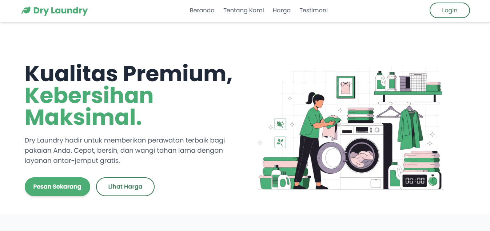
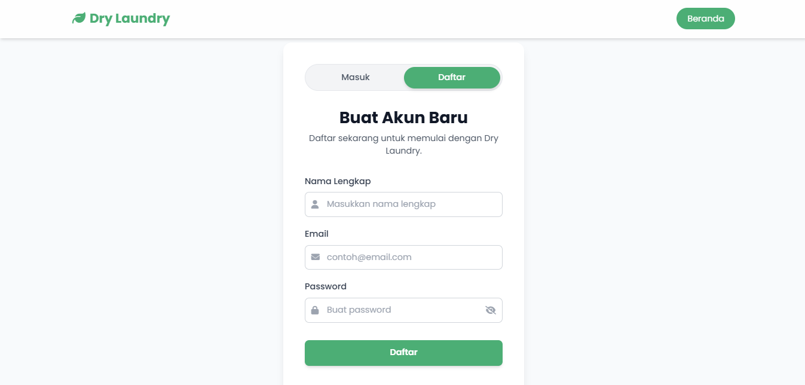

🌿 Dry Laundry - Landing Page

Dry Laundry adalah sebuah landing page sederhana yang dibuat untuk keperluan laundry. Website ini menampilkan informasi utama seperti layanan, harga, testimoni pelanggan. Dibuat dengan fokus pada desain yang responsif, project ini juga menggunakan Tailwind CSS framework UI agar lebih mudah lagi untuk di kembangkan.

✨ Fitur
- Desain UI/UX Sudah full reponsife
- Include register dan login juga.
- Code nya sudah saya dibikin se clean mungkin.
- Open source dan dapat dikembangkan ulang
- 
📷 Screenshot

Tampilan antarmuka dari website:

Screenshot 1:

Screenshot 2:

🌐 Live Preview

Lihat langsung hasilnya di sini:
🔗 https://draxxcdr.github.io/landing_page_laundry/

📦 Tech Stack
- HTML5
- Tailwind CSS v3
- JavaScript
- Node.js (untuk kebutuhan pengembangan dengan Tailwind CLI)

📌 Requirement
Sebelum memulai project ini, pastikan sudah menginstall:
- Node.js & npm (https://nodejs.org/)
- Git (https://git-scm.com/)

🚀 Cara Menjalankan Project
Jika kamu hanya ingin menjalankan landing page-nya:

1. Clone repository:
   git clone https://github.com/draxxcdr/landing_page_laundry.git

2. Masuk ke folder project:
   cd landing_page_laundry

3. Install Tailwind CSS secara lokal:
   npm install -D tailwindcss@3

4. Jalankan Tailwind CLI untuk meng-compile CSS:
   npx tailwindcss -i ./src/input.css -o ./src/output.css --watch

5. Buka file index.html di browser untuk melihat hasilnya.

🔧 Untuk Pengembangan Lebih Lanjut
Jika kamu developer dan ingin mengembangkan landing page ini lebih lanjut:
- Gunakan Tailwind CSS v3
- CSS utama berada di src/input.css (jangan edit langsung output.css)
- Jalankan perintah watch agar style terupdate otomatis
- Gunakan Live Server (VSCode Extension) agar bisa live reload

📖 Lisensi
Project ini open source dan tersedia secara gratis untuk digunakan, dimodifikasi, atau dikembangkan ulang oleh siapa saja. Tidak perlu izin untuk penggunaan pribadi atau komersial, tapi apresiasi tetap dihargai.

🤝 Kontribusi
Jika ingin berkontribusi, silakan fork project ini dan ajukan pull request. Saran dan masukan sangat terbuka!

📬 Kontak
Untuk pertanyaan atau kerja sama, hubungi melalui GitHub atau email: syahrulmy0203@gmail.com

Dibuat oleh draxxcdr (https://github.com/draxxcdr)
